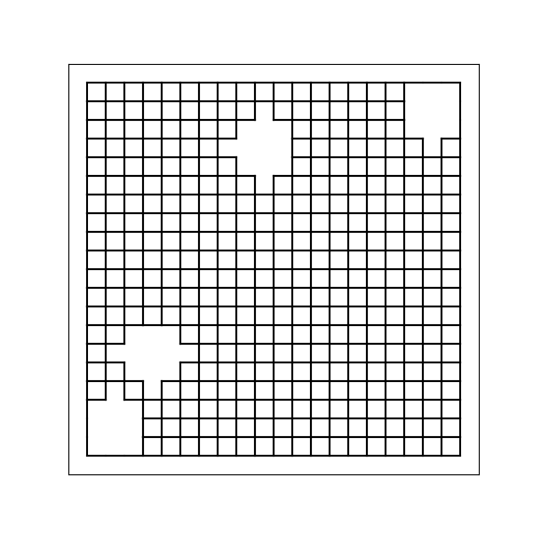
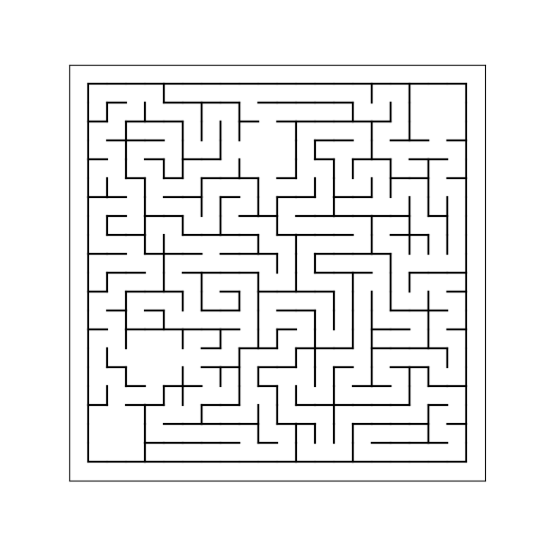
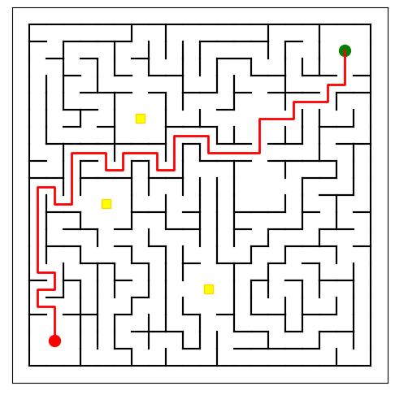
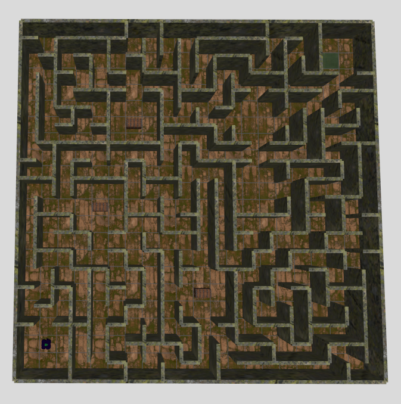

# 🧱 Maze Generator for Gazebo / ROS 2

## 📌 Project Goal

This project generates a complete **maze in SDF format** (`.world`), compatible with **Gazebo Harmonic** and **ROS 2 Jazzy**. The maze is fully created in Python, featuring modular wall segments, and can be easily extended with ramps, rooms, goals, or interactive objects.

---

## 🛠️ Setup & Prerequisites

Before running the maze generator, set up a Python virtual environment and install the required dependencies:

```bash
# Create a virtual environment
python3 -m venv venv

# Activate the virtual environment
# On Linux/macOS:
source venv/bin/activate
# On Windows:
venv\Scripts\activate

# Install required dependencies
pip install -r requirements.txt
```

**Note:** Tested with Python 3.12.3

---

## 🚀 How to Run

```bash
python3 main.py
```

This will:

* Export the maze as a Gazebo `.world` file
* Save visualization images

---

## ✅ Implemented Features

### ✔️ Maze Generation

* Algorithm: **Iterative Depth-First Search** (DFS) for maze carving
* Guarantees a **fully connected maze** with guaranteed paths between all cells
* Includes **start and goal rooms** (3×3 cells) at opposite corners
* Supports **random interior rooms** with configurable quantity

### ✔️ Pathfinding & Visualization

* Finds the path from start to end using BFS
* Draws the maze with solution path overlayed in `maze_step3_solution.png`
* Draws treasure chests as small yellow squares inside the maze

### ✔️ Maze Export to Gazebo World

* Converts maze cells and walls into optimized Gazebo `<include>` models
* Walls combined into large segments (`8m`, `4m`, `2m`, `1m`) for performance
* Maze origin centered at `(0, 0)` with correct wall pose calculation
* Outputs a fully functional `.world` file (`maze_world.world`) for simulation

### ✔️ Multi-Level Support
* **Multiple floors** can be created with configurable height levels
* **Ramps** between floors allow the robot to navigate between levels
* Each floor has its own maze layout with connected pathways

### ✔️ Lighting System
* **Wall lamps** are randomly distributed throughout the maze
* Lamps provide ambient lighting for better visual experience
* Configurable lamp density and placement probability

### ✔️ Treasure System
* **Treasure chests** are randomly placed in rooms
* Chests serve as points of interest throughout the maze
* Visual markers help identify chest locations

---

## 🧩 Maze Generation Step by Step

| Step                            | Description                                                                         | Preview                                                 |
| ------------------------------- | ----------------------------------------------------------------------------------- | ------------------------------------------------------- |
| **1. Rooms Only Maze**          | Maze after placing start, goal, and random rooms with chests                        |   |
| **2. After Maze Carving**       | Maze after carving paths between rooms                                              |  |
| **3. Final Maze with Solution** | Maze visualization with shortest path from start to goal and treasure chests marked |  |
| **4. Gazebo World Preview**     | Visualization of the exported maze in Gazebo                                        |           |

---

## 🧠 Key Design Decisions & Learnings

### Maze Algorithm

* Uses **iterative DFS** for carving paths, ensuring a fully connected maze
* Rooms are explicitly marked as visited areas and carved separately
* Multiple attempts ensure a valid maze with full connectivity

### Wall Optimization

* Detects and merges consecutive wall cells into larger wall segments
* Reduces number of Gazebo model `<include>` elements for better simulation performance
* Supports wall segments of sizes `[8m, 4m, 2m, 1m]`

### Pathfinding & Connectivity
* **BFS algorithm** used for pathfinding and connectivity verification
* Ensures all areas of the maze are reachable from the start position
* Provides visual representation of the optimal path through the maze

### Performance Optimization
* **Simple collision shapes** significantly improve simulation performance
* **Optimal performance** achieved with single-floor mazes
* Each additional floor adds substantial performance overhead

### Maze Positioning and Export

* Maze centered around `(0, 0)` by offsetting wall positions
* Each wall segment correctly oriented with position and yaw angle
* Generates a valid `.world` file including ground plane and sun light source

---

## 📚 Sources & References

### Material & Asset References
- **Ground Material**: [Rocky Terrain from Poly Haven](https://polyhaven.com/a/rocky_terrain) (CC0)
- **Wall Material**: [Mossy Rock from Poly Haven](https://polyhaven.com/a/mossy_rock) (CC0)
- **Ramp Material**: [Japanese Stone Wall from Poly Haven](https://polyhaven.com/a/japanese_stone_wall) (CC0)
- **Chest Model**: [Treasure Chest from Poly Haven](https://polyhaven.com/a/treasure_chest) (CC0)
- **Lamp Model**: [Industrial Wall Lamp from Poly Haven](https://polyhaven.com/a/industrial_wall_lamp) (CC0)

### Code References
- **Room Generation Algorithm**: [Rooms and Mazes - journal.stuffwithstuff.com](https://journal.stuffwithstuff.com/2014/12/21/rooms-and-mazes/)
- **Maze Cell Structure**: [Build a Maze Game in Python - thepythoncode.com](https://thepythoncode.com/article/build-a-maze-game-in-python)
- **Pathfinding Concepts**: [Basic Pathfinding Explained with Python - codementor.io](https://www.codementor.io/blog/basic-pathfinding-explained-with-python-5pil8767c1)
- **BFS Algorithm Theory**: [Breadth-first Search - Wikipedia](https://en.wikipedia.org/wiki/Breadth-first_search)
- **BFS Python Implementation**: [Solve Maze using BFS Algorithm - medium.com](https://medium.com/@luthfisauqi17_68455/artificial-intelligence-search-problem-solve-maze-using-breadth-first-search-bfs-algorithm-255139c6e1a3)

_Last accessed: 01-09-2025_