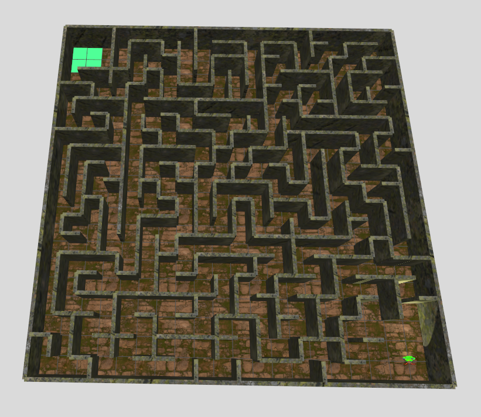

# 🧱 Maze Generator for Gazebo / ROS 2

## 📌 Project Goal

This project generates a complete **maze in SDF format** (`.world`), compatible with **Gazebo Harmonic** and **ROS 2 Jazzy**. The world consists of modular wall segments, is entirely created via Python, and can be extended arbitrarily - e.g., with ramps, goals, rooms, or interactive objects.



## ✅ Currently Implemented

### ✔️ Maze Generation
- Algorithm: **Iterative Depth-First Search** (previously Recursive Backtracking)
- Fully connected maze with guaranteed paths between all cells
- **Start and goal rooms** (3×3 cells) at opposite corners

### ✔️ Wall Placement Optimization
- Walls are placed as large segments (`8m`, `4m`, `2m`, `1m`)
- Reduces number of `<include>` entries → better simulation performance

### ✔️ Proper World Placement
- Maze origin is centered around `(0, 0)`
- All wall `<pose>` entries correctly calculated relative to center

### ✔️ Complete `.world` File
- Includes:
  - Standard Gazebo plugins (Physics, IMU, Scene, UserCommands)
  - Light source (Sun)
  - Ground plane
  - All walls
- Automatically generated as `maze_world.world`

### ✔️ Automatic Outer Boundary
- All four edges are enclosed with continuous walls
- Prevents robots from accidentally leaving the maze

---

## 📌 Planned Extensions

| Feature                      | Status     |
|-----------------------------|------------|
| Start/Goal Markings         | ✅ Done    |
| Interior Rooms              | ✅ Done    |
| Objects (e.g., boxes)       | ❌ Open    |
| Ramps / Second Floor        | ❌ Open    |

## 🧠 Key Design Decisions

### 🔁 Maze Algorithm
- Uses **Iterative DFS** (converted from recursive backtracking)
- Advantage: Guarantees connected maze without isolated sections

### 🧱 Wall Optimization
* Long straight walls automatically detected and placed as large segments
* Fewer models → faster loading → better FPS
* Prioritized segment lengths: `[8, 4, 2, 1]`

### 📐 Positioning and Offset
* Maze cells start at `(-maze_width/2, -maze_height/2)` for center origin
* Wall models placed with correct offset along their orientation
* Unique wall names (`wall_2m_42` etc.) to avoid conflicts

## 🚀 Execution

```bash
python3 maze_generator.py